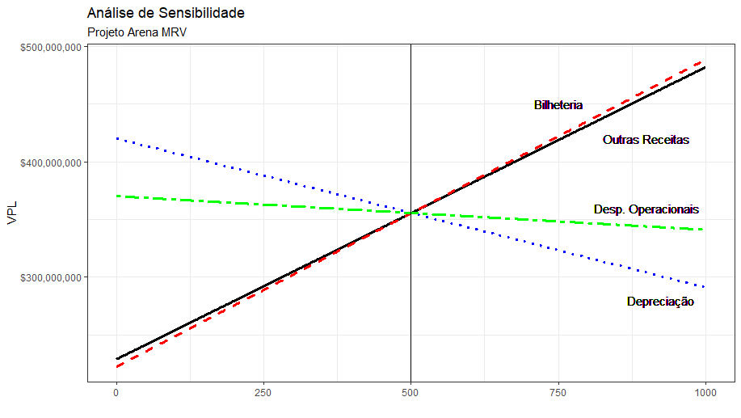

#### Integrantes do Grupo:

* Abner Carvalho
* Bruno Marcelino 
* Daniel Rocha      

### Bibliotecas Importadas

```{r, warning = FALSE}
library("tvm")
library("triangle")
```

A análise do projeto será feita utilizando uma Simulação de Monte Carlo, utilizando o Software R para tornar o processo viável. A simulação é uma ferramenta relevante pois possibilita a atribuição de distribuições de probabilidade a variáveis que serão projetadas para o futuro, considerando assim uma medida de risco no recebimento dos fluxos de caixa esperados. 

### Pressupostos ao longo do período: 

##### Taxa de crescimento

Assumimos que todos os fluxos de caixa gerados deverão ser ajustados por uma taxa que considere o prêmio de risco de inflação. A ideia geral é de considerar que todos os valores a serem inclusos na DRE incremental do projeto serão constantemente reavaliados para que não haja perda do poder aquisitivo ao longo da vida útil do projeto, desde as receitas (aumento do preço dos ingressos ao longo do tempo, por exemplo) até as despesas. 

```{r}
g <- 0.0275 # Selic anual vigente no mercado

ajuste_inf <- function(fluxo, tempo){ # Será utilizada para ajustar a série de fluxos de caixa conforme a inflação acumulada
    tempo <- seq(1:tempo)
    fluxo <- fluxo*(1+g)^tempo
    return(fluxo)
    } 
```

##### Calculando o custo de oportunidade do shopping

Sabemos que, do investimento inicial, 250 milhões foram oriundos da venda de 50,1% da participação do Atlético como dono do Shopping Diamond Mall. No passado, construtora Multiplan foi contratada para a realização do empreendimento e possui (até hoje) direito de recebimento de 15% dos lucros retidos. Caso o Atlético mantivesse sua participação como dono do shopping, 

```{r}
taxa <- function(pv, fv, n){ # Função que retorna a taxa dado PV, FV e n
    i = ((fv/pv)^(1/n)) - 1
    return(i)    
    }

k <- taxa(250, 290, 2) # Retorna o custo de oportunidade 
```

### Cenário Base

Todos os dados foram retirados de documentos oficiais disponibilizados publicamente pelo Clube Atlético Mineiro aos conselheiros. Alguns dados foram ajustados por novas projeções feitas pelo clube ao longo do tempo, após o recebimento de novas propostas de negócios oriundos do projeto. 

```{r}
# Custos Iniciais
arrecadacao_inicial <- 510000000
terreno <- 50000000

### Receitas Fixas

# T1
receita_cadeiras_t1 <- 100000000 * 0.8
receita_camarotes_t1 <- 80000000 * 0.92
receita_naming_rights_t1 <- 60000000

# T2
receita_cadeiras_t2 <- 100000000 * 0.2
receita_camarotes_t2 <- 80000000 * 0.08

### Receitas Variáveis 

# Receitas Líquidas de Novos Negócios
outras_receitas_base <- (17592700 + 40000000 + 17592700) / 2

# Receitas de Bilheteria
receita_bilheteria_base <- 38 * 43.2 * 24083 # Jogos * Ingresso * Público

# Despesas Operacionais (excl. dep)
despesas_operacionais_base <- 19195000

# Depreciação
depreciacao_base <- (0.0166 + 0.0333)/2 # Média da depreciação estimada no balanço do Palmeiras (Allianz Parque foi utilizado como critério de comparação)
```

##### Critérios de Avaliação do Projeto Base

```{r, echo = FALSE}
# Quantidade de Fluxos de Caixa de Risco (variáveis)
n <- 21

# Fluxos de Receitas Fixas
fluxos_fixos <- c(receita_cadeiras_t1 + receita_camarotes_t1 + receita_naming_rights_t1,
                  receita_cadeiras_t2 + receita_camarotes_t2)

### Receitas Variáveis 

# Receitas com Novos Negócios
outras_receitas <- rep(outras_receitas_base, n)

# Receitas com Bilheteria
receita_bilheteria <- rep(receita_bilheteria_base, n)  # Jogos * Ingresso * Público

# Despesas Operacionais (excl. dep)
despesas_operacionais <- despesas_operacionais_base

# Depreciação
depreciacao <- rep(depreciacao_base * (arrecadacao_inicial), n) # Balanço do Palmeiras

# Lucro Operacional Líquido
lucro_bruto_operacional <- receita_bilheteria + outras_receitas - despesas_operacionais - depreciacao
fluxo_de_caixa_livre <- lucro_bruto_operacional + depreciacao

# Ajuste do FCl pelo g 
fluxo_de_caixa_livre <- ajuste_inf(fluxo_de_caixa_livre, n)

# Investimento Inicial
investimento <- arrecadacao_inicial + terreno

# Valor Contábil Líquido (a ser acrescentado ao final do projeto para critérios de realização do imóvel)
valor_residual <- arrecadacao_inicial - sum(depreciacao) 
fluxo_de_caixa_livre[n] <- fluxo_de_caixa_livre[n] + valor_residual

##### Parâmetros
FC <- c(-investimento, fluxos_fixos, fluxo_de_caixa_livre)

##### Critérios de Avaliação
vpl <- npv(k, FC)
tir <- irr(FC)

# Tabela com os inputs
cenario_base <- c("Outras Receitas (milhões)", "Bilheteria (milhões)", "Desp. Operacionais (milhões)", "Taxa de Depreciação", "VPL (milhões)", "TIR")
cenario_base_2 <- c(outras_receitas_base/1000000, receita_bilheteria_base/1000000, despesas_operacionais_base/1000000, depreciacao_base, vpl/1000000, tir)
cenario_base <- data.frame("Variáveis" = cenario_base, "Dados" = cenario_base_2)

knitr::kable(cenario_base)
```

### Análise de Sensibilidade

Permite avaliar a variação ocorrida no VPL, dada a alteração proporcional no valor de uma variável mantendo tudo constante. Quanto maior a inclinação da curva que representa cada variável, mais sensível é o VPL a uma alteração em uma unidade dessa variável. O valor mínimo do eixo X (zero) representou uma alteração de -30% em cada variável, e o máximo (1000) representou uma alteração de +30% no valor de uma variável. O cenário base é representado no ponto médio do gráfico (500).



### Realização da Simulação: 

Utilizamos um `for` loop como método para realizar a operação de simulação do investimento quantas vezes fosse necessário, de forma iterativa. O processo consiste na geração de diversas variáveis aleatórias para algumas das entradas (tendo outras assumindo valor proporcional ao das mais relevantes). Vetores nulos foram criados para armazenar os resultados obtidos.

```{r}
# Quantidade de simulações 
simulacoes <- 1000
```

```{r, echo = FALSE}
    # Avaliação  
    vpl <- vector('numeric', length = simulacoes)
    tir <- vector('numeric', length = simulacoes)
    
    # Fluxos de Caixa
    fluxos_de_caixa <- matrix(nrow = simulacoes, ncol = n+3) # n fluxos de caixa aleatórios + n investimentos fixos (0, 1 e 2)
    
    # Variáveis
    outras_rec <- vector('numeric', length = simulacoes)
    rec_bilheteria <- vector('numeric', length = simulacoes)
    dep <- vector('numeric', length = simulacoes)
    desp_operacionais <- vector('numeric', length = simulacoes)
```

```{r, warning = FALSE}

for (i in seq(1:simulacoes)){
    
    ##### Inputs
    
    ### Receitas Fixas
    
    # T1
    receita_cadeiras_t1 <- 100000000 * 0.8
    receita_camarotes_t1 <- 80000000 * 0.92
    receita_naming_rights_t1 <- 60000000
    
    # T2
    receita_cadeiras_t2 <- 100000000 * 0.2
    receita_camarotes_t2 <- 80000000 * 0.08
    
    # Fluxos de Receitas Fixas
    fluxos_fixos <- c(receita_cadeiras_t1 + receita_camarotes_t1 + receita_naming_rights_t1,
                      receita_cadeiras_t2 + receita_camarotes_t2)
    
    ### Receitas Variáveis
    
    # Receitas com Novos Negócios
    outras_receitas <- rtriangle(n, 17592700, 17592700 + 40000000)
    outras_rec[i] <- mean(outras_receitas)
    
    # Receitas com Bilheteria
    copa_brasil <- as.integer(runif(n, 1, 10))
    libertadores <- as.integer(runif(n, 3, 7))
    jogos <- copa_brasil + libertadores + 27
    receita_bilheteria <- jogos * 43.2 * 24083
    rec_bilheteria[i] <- mean(receita_bilheteria)
    
    ### Despesas
    
    # Despesas Operacionais (excl. dep)
    receita_variavel <- outras_receitas + receita_bilheteria
    despesas_operacionais <- (19195000/mean(receita_variavel)) * receita_variavel
    desp_operacionais[i] <- despesas_operacionais
    
    # Depreciação
    arrecadacao_inicial <- 510000000
    terreno <- 50000000
    depreciacao <- runif(n, 0.0166, 0.0333) * (arrecadacao_inicial) 
    dep[i] <- mean(depreciacao)
    
    # Lucro Operacional Líquido
    lucro_bruto_operacional <- receita_bilheteria + outras_receitas - despesas_operacionais - depreciacao
    fluxo_de_caixa_livre <- lucro_bruto_operacional + depreciacao
    
    # Ajuste do FCl pelo g 
    fluxo_de_caixa_livre <- ajuste_inf(fluxo_de_caixa_livre, n-3)
    
    # Investimento Inicial
    investimento <- arrecadacao_inicial + terreno
    
    # Custo Médio Ponderado do Capital = k
    
    # Valor Contábil Líquido (a ser acrescentado ao final do projeto para critérios de realização do imóvel)
    valor_residual <- arrecadacao_inicial - sum(depreciacao) 
    fluxo_de_caixa_livre[n] <- fluxo_de_caixa_livre[n] + valor_residual
    
    ##### Parâmetros
    fluxos <- c(-investimento, fluxos_fixos, fluxo_de_caixa_livre)
    fluxos_de_caixa[i,] <- fluxos
    
    ##### Critérios de Avaliação
    vpl[i] <- npv(k, fluxos)/1000000
    tir[i] <- irr(fluxos)
}
```

Podemos avaliar os fluxos a serem obtidos após o final do período como sendo frutos de perpetuidades crescentes em relação à inflação, porém optamos pela realização do imóvel pelo seu valor contábil líquido ao final do período do projeto.

```{r}
# Perpetuidade Constante (a partir de t = 24)
    perpetuidade <- fluxo_de_caixa_livre[n] / (k - g)
    fluxo_de_caixa_livre[n] <- fluxo_de_caixa_livre[n] + perpetuidade
```

### Avaliação da Simulação: 

##### Variáveis Aleatórias

Cabeçalho da tabela com os resultados médios encontrados para as variáveis incorporadas ao longo do período vigente em cada simulação, além do VPL (em milhões) e da TIR de cada uma. 

```{r, echo = FALSE}
variaveis <- data.frame("Outras Receitas" = outras_rec,
                    "Bilheteria" = rec_bilheteria, 
                    "Depreciação" = dep,
                    "Despesas Operacionais" = desp_operacionais,
                    "VPL" = vpl,
                    "TIR" = tir
                    )

knitr::kable(head(variaveis))
```

##### Histogramas de VPL e TIR

Criamos histogramas para representar a distribuição de frequência dos valores obtidos para VPL e TIR, que sintetizam o risco do projeto. 

```{r, echo = FALSE}

# Gráficos dos Resultados
par(mfrow = c(1,2))
hist(vpl, main = "VPL", col = 2, xlab = "Valor Presente Líquido", ylab = "Frequência", cex.axis = 1)
hist(tir, main = "TIR", col = 4, xlab = "Taxa Interna de Retorno", ylab = "", cex.axis = 1)
```

##### Estatísticas Descritivas da Simulação

```{r, echo = FALSE}

# Input das Estatísticas do VPL e TIR
media <- c(mean(vpl), mean(tir))
dp <- c(sd(vpl), sd(tir))
maximo <- c(max(vpl), max(tir))
minimo <- c(min(vpl), min(tir))
mediana <- c(median(vpl), median(tir))

prop_positivo <- c( # Proporção na qual IRR e VPL se encontram positivos
    sum(ifelse(vpl >= 0, 1, 0))/simulacoes,
    sum(ifelse(tir >= 0, 1, 0))/simulacoes
) 

quantil_inf <- c(quantile(vpl, 0.025), quantile(tir, 0.025))
quantil_inf <- unname(quantil_inf) # Limite Inferior IC 5%

quantil_sup <- c(quantile(vpl, 0.975), quantile(tir, 0.975))
quantil_sup <- unname(quantil_sup) # Limite Superior IC 5%

# Tabela com as estatísticas
estatisticas <- rbind(media, dp, maximo, minimo, mediana, prop_positivo, quantil_inf, quantil_sup)
colnames(estatisticas) <- c("VPL (em milhões)", "TIR (termos percentuais)") 
rownames(estatisticas) <- c("Média", "Desvio-Padrão", "Máximo", "Mínimo", "Mediana", "Proporção > 0", "Quantil 2.5%", "Quantil 97,5%")
estatisticas[ ,2] <- estatisticas[ ,2] * 100
estatisticas[6,2] <- estatisticas[6,2]/100
estatisticas <- round(estatisticas, 2)

knitr::kable(estatisticas)
```


